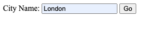
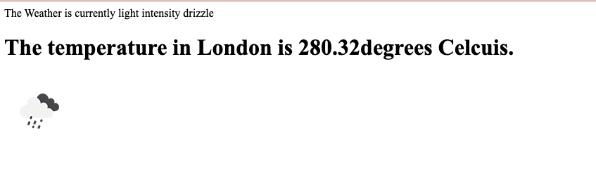
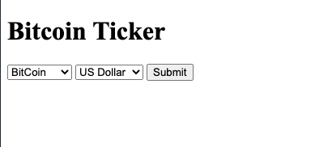
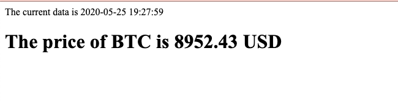
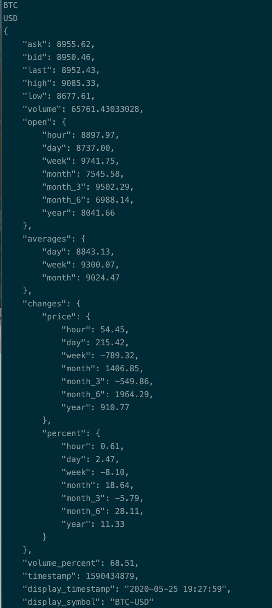

# API - JSON
## Newsletter-Signup
A signup page collect user's information in Mailchimp. send back to user success/failure feedback.
The page has been posted in Heroku! \
[Check me!📩](https://secret-harbor-10646.herokuapp.com/)

## WeatherProject
API: [OpenWeather ☁️](https://openweathermap.org/api)
A page that send user current weather in different city.

 \

## Bitcoin-Ticker
API: [Bitcoinaverage 💰](apiv2.bitcoinaverage.com)
A page that get real-time, OHLC, volume and historical price data for the following Cryptocurrencies:
Bitcoin (BTC), Bitcoin Cash (BCH), Litecoin (LTC), Ethereum (ETH), Dash (DASH), Ripple (XRP), Monero (XMR) plus many more.

 \
 \
 \