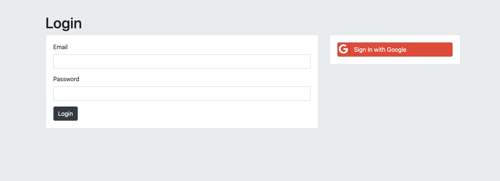

# Authentication-Security
## Password-Security
Ensure users' information security with multiple methods:
1. Database Encryption
2. Hashing password
3. Salting and Hashing password with bcrypt
4. Cookies and Sessions
5. Login with Google!

### Home Page 

### Login Page 

### Google Login

### Secret(with cookie)

