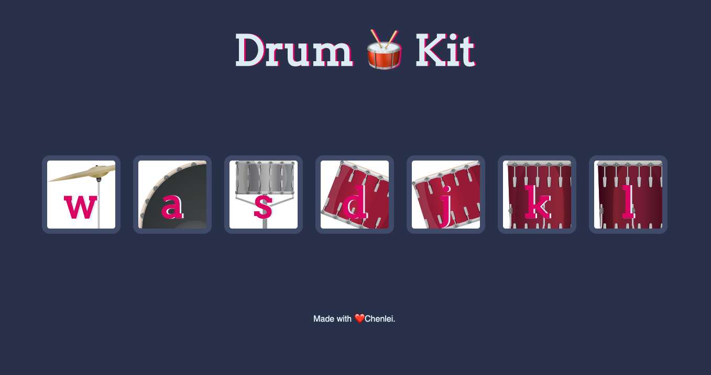

# Javascript Practice
* DICEE GAME
  A game that use two dice to randomly justify who wins.

* Drum Kit
  A game.
  When the player clicks on different musical instrument pictures, different sounds will be generated, thus producing different melodies.

 

* Simon Game 
  A game that tests memory skills. The device creates a series of tones and lights and requires a user to repeat the sequence. If the user succeeds, the series becomes progressively longer and more complex. Once the user fails or the time limit runs out, the game is over. 

 