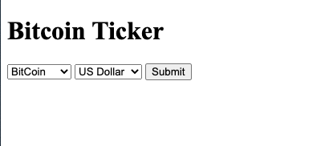
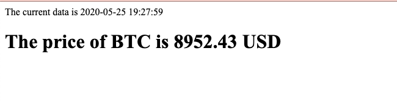
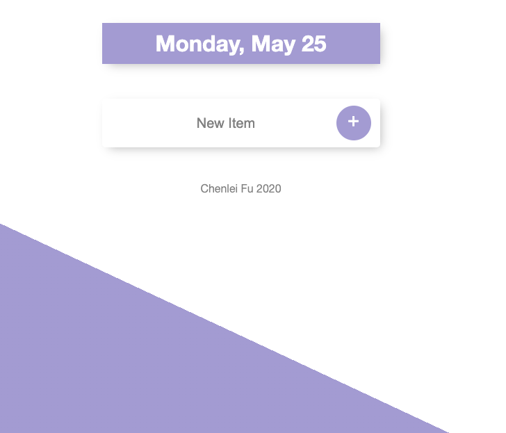
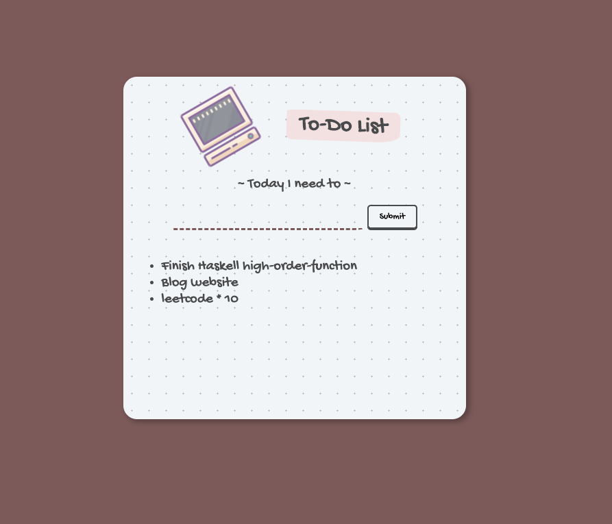

# Complete-Web-Bootcamp
course website: [Udemy](https://www.udemy.com/course/the-complete-web-development-bootcamp/)
Instructor: Dr.Angela Yu

Course Content:
1. HTML CSS
2. Bootstrap4
3. Javascript & jQuery
4. Express.js
5. API JSON Heroku
6. EJS
7. Mongodb - Mongoose
8. Build REST API
9. Authentication & Security
10. React.js

## Project Lists:

### 1. CV-Theme-01
A simple Curriculum vitae template 🍻

Checkout the live demo [here](https://chenlei-fu.github.io/CV-Theme-01/).

### 2. TinDog-Landing-page
A landing page for finding dogs nearby
[🐶TinDog](https://chenlei-fu.github.io/TinDog-Landing-page/)

#### Language
boostrap, css, html

### 3. Javascript Practice
* DICEE GAME
  A game that use two dice to randomly justify who wins.

* Drum Kit
  A game.
  When the player clicks on different musical instrument pictures, different sounds will be generated, thus producing different melodies.

 

* Simon Game 
  A game that tests memory skills. The device creates a series of tones and lights and requires a user to repeat the sequence. If the user succeeds, the series becomes progressively longer and more complex. Once the user fails or the time limit runs out, the game is over. 

 

### 4. Express.js with Node.js
A Calculator that get user's input and send the result back to them.

### 5. API - JSON
### Newsletter-Signup
A signup page collect user's information in Mailchimp. send back to user success/failure feedback.
The page has been posted in Heroku! \
[Check me!📩](https://secret-harbor-10646.herokuapp.com/)

### WeatherProject
API: [OpenWeather ☁️](https://openweathermap.org/api)
A page that send user current weather in different city.

 \

### Bitcoin-Ticker
API: [Bitcoinaverage 💰](apiv2.bitcoinaverage.com)
A page that get real-time, OHLC, volume and historical price data for the following Cryptocurrencies:
Bitcoin (BTC), Bitcoin Cash (BCH), Litecoin (LTC), Ethereum (ETH), Dash (DASH), Ripple (XRP), Monero (XMR) plus many more.

 \
 \
 \

### 6. ToDoList!

### todolist-v1
Multi pages todolist \

### todolist-v2
A single page todolist \

### 7. Blog Website
A multi-page daily journal.

 \

### 8. Database Practice
A simple database create/delete/analyse using mongoose.

### Todolist-final

A user-oriented Todolist design. When a user adds a subpage(__/XXX) to the address, the system will automatically create a todolist category and apply pagetitle to the todolist title.
At the same time, the user-created todolist database will be recorded locally using mongoose. Recommend Users use Robo 3T to view local database!

Home page: \
 \

Test new page: \

### Blog With Database
A multi-page daily journal.

Homepage: \
 \

postpage: \
 \

database: \

### 9. Build RESTful API
An Wiki Api

### 10. Authentication-Security
### Password-Security
Ensure users' information security with multiple methods:
1. Database Encryption
2. Hashing password
3. Salting and Hashing password with bcrypt
4. Cookies and Sessions
5. Login with Google!

### Home Page 

### Login Page 

### Google Login

### Secret(with cookie)

### 11. React
* Introduction to Code Sandbox
* JSX Code Practice
* Javascript Expressions in JSX & ES6 Template Literals
* Statements vs. Expressions
* JSX Attributes & Styling React Elements
* Inline Styling for React Elements
* React Components
* Javascript ES6 - Import, Export and Modules
* React Props
* React DevTools
* Mapping Data to Components
* Javascript ES6 Map/Filter/Reduce
* Javascript ES6 Arrow functions
* React Conditional Rendering with the Ternary Operator & AND Operator
* State in React - Declarative vs. Imperative Programming
* React Hooks - useState
* Javascript ES6 Object & Array Destructuring
* Event Handling in React
* React Forms
* Class Components vs. Functional Components
* Changing Complex State 
* Javascript ES6 Spread Operator
* Managing a Component Tree

### React Projects
* Interactive Form
  
  
* Todolist
  
  
* Keeper Note App
  
  

### Certificate of Completion

