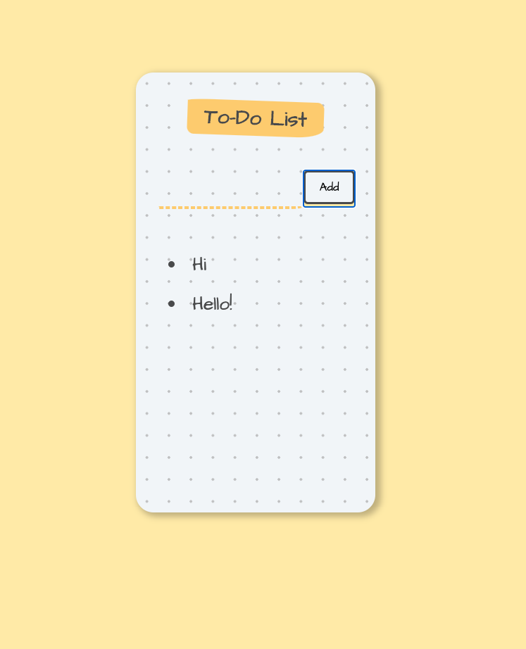

## React
* Introduction to Code Sandbox
* JSX Code Practice
* Javascript Expressions in JSX & ES6 Template Literals
* Statements vs. Expressions
* JSX Attributes & Styling React Elements
* Inline Styling for React Elements
* React Components
* Javascript ES6 - Import, Export and Modules
* React Props
* React DevTools
* Mapping Data to Components
* Javascript ES6 Map/Filter/Reduce
* Javascript ES6 Arrow functions
* React Conditional Rendering with the Ternary Operator & AND Operator
* State in React - Declarative vs. Imperative Programming
* React Hooks - useState
* Javascript ES6 Object & Array Destructuring
* Event Handling in React
* React Forms
* Class Components vs. Functional Components
* Changing Complex State 
* Javascript ES6 Spread Operator
* Managing a Component Tree

## Projects
* Interactive Form
  
  
* Todolist
  
  
* Keeper Note App
  
  

