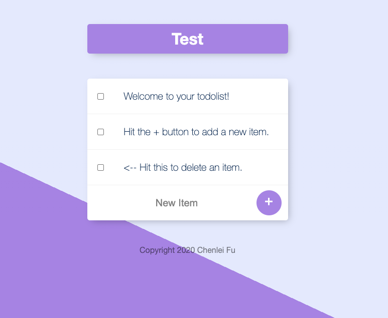

# Todolist-v2

A user-oriented Todolist design. When a user adds a subpage(__/XXX) to the address, the system will automatically create a todolist category and apply pagetitle to the todolist title.
At the same time, the user-created todolist database will be recorded locally using mongoose. Recommend Users use Robo 3T to view local database!

Home page: \
 \

Test new page: \
